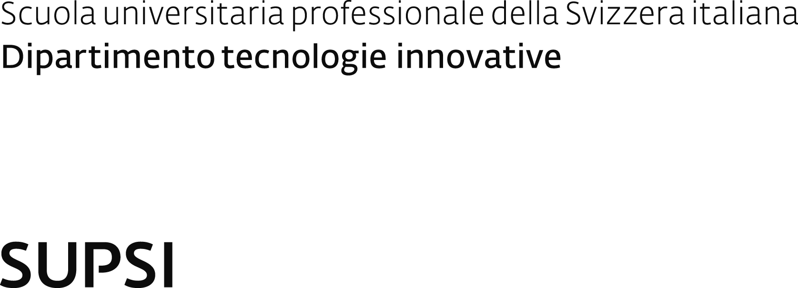

# Project Title
<br><br>


<div class="container">
    <div class="aside">
        <hr>
        <div class="row">
            <div class="column-thirds">Studente/i</div>
            <div class="column-thirds">Relatore</div>
            <div class="column-thirds">Correlatore</div>
        </div>
        <div class="row">
            <div class="column-thirds text">Nome Cognome</div>
            <div class="column-thirds text">Nome Cognome</div>
            <div class="column-thirds text">Nome Cognome</div>
        </div>
        <br>
        <hr>
        <div class="row">
            <div class="column-thirds">Corso di laurea</div>
            <div class="column-thirds">Modulo/Codice Progetto</div>
            <div class="column-thirds">Anno</div>
        </div>
        <div class="row">
            <div class="column-thirds text">Corso XYZ</div>
            <div class="column-thirds text">X-Y0000-0</div>
            <div class="column-thirds text">SX XXYY</div>
        </div>
        <br>
        <hr>
        <div class="row">
            <div class="column-thirds">Committente</div>
            <div class="column-thirds">Data</div>
        </div>
        <div class="row">
            <div class="column-thirds text">Nome Cognome</div>
            <div class="column-thirds text">DD.MM.YYYY</div>
        </div>
    </div>
    <div class="row">
        
    </div>
</div>

---


<br><br>

## Slide Title

<div class="container">
    <div class="aside">
        <div class="row">
            <div class="column-halves">
                <p>Your text here...</p>
            </div>
            <div class="column-halves">
                <p>Your image here</p>
            </div>
        </div>
    </div>
    <div class="row">
        
    </div>
</div>

---


<br><br>

<div class="container">
    <div class="aside">
        <div class="row">
            <div class="column-halves">
                <p>Your text here...</p>
            </div>
            <div class="column-halves">
                <p>Your image here</p>
            </div>
        </div>
    </div>
    <div class="row">
        
    </div>
</div>

---


=> tree
.
├── README.md
├── assets
│   ├── supsi_big.png
│   └── supsistudent.png
├── components
├── example.md
├── layouts
│   ├── cover.vue
│   └── intro.vue
├── package.json
├── setup
│   └── shiki.ts
└── styles
    ├── index.ts
    └── layout.css

6 directories, 10 files
=> pnpm install
 ERROR  Unexpected token ']', ..."udent",  ],  "engi"... is not valid JSON while parsing '{  "name": "slidev-theme-SUPSISTUDENT",' in /Users/lucamazza/SUPSISTUDENT/package.json
For help, run: pnpm help install
=> nvim
=> pnpm install

   ╭──────────────────────────────────────────────────────────────────╮
   │                                                                  │
   │                Update available! 10.4.1 → 10.6.3.                │
   │   Changelog: https://github.com/pnpm/pnpm/releases/tag/v10.6.3   │
   │                Run "pnpm add -g pnpm" to update.                 │
   │                                                                  │
   ╰──────────────────────────────────────────────────────────────────╯

Downloading monaco-editor@0.51.0: 18.38 MB/18.38 MB, done
Downloading cytoscape-fcose@2.2.0: 7.60 MB/7.60 MB, done
Downloading mermaid@11.5.0: 13.86 MB/13.86 MB, done
Packages: +632
++++++++++++++++++++++++++++++++++++++++++++++++++++++++++++++++++++++++++++++++++++++++++++++++++++++++++++++++++++++++++++++++++++++++++++++++
Progress: resolved 674, reused 5, downloaded 627, added 632, done

dependencies:
+ @slidev/types 51.4.0

devDependencies:
+ @slidev/cli 51.4.0

╭ Warning ───────────────────────────────────────────────────────────────────────────────────╮
│                                                                                            │
│   Ignored build scripts: esbuild.                                                          │
│   Run "pnpm approve-builds" to pick which dependencies should be allowed to run scripts.   │
│                                                                                            │


=> nvim
=> nvim

    ~/Projects/nm-reporting  dev*                                                                                                   21m 58.979s
=> cd ../..
- 🛠 **Hackable** - virtually anything that's possible on a webpage is possible in Slidev

<br>
<br>

Read more about [Why Slidev?](https://sli.dev/guide/why)

---

# Navigation

Hover on the bottom-left corner to see the navigation's controls panel

## Keyboard Shortcuts

|     |     |
| --- | --- |
| <kbd>space</kbd> / <kbd>tab</kbd> / <kbd>right</kbd> | next animation or slide |
| <kbd>left</kbd>  / <kbd>shift</kbd><kbd>space</kbd> | previous animation or slide |
| <kbd>up</kbd> | previous slide |
| <kbd>down</kbd> | next slide |

---
layout: image-right
image: https://cover.sli.dev
---

# Code

Use code snippets and get the highlighting directly!

```ts
interface User {
  id: number
  firstName: string
  lastName: string
  role: string
}

function updateUser(id: number, update: Partial<User>) {
  const user = getUser(id)
  const newUser = { ...user, ...update }
  saveUser(id, newUser)
}
```

---
layout: center
class: "text-center"
---

# Learn More

[Documentation](https://sli.dev) / [GitHub Repo](https://github.com/slidevjs/slidev)
